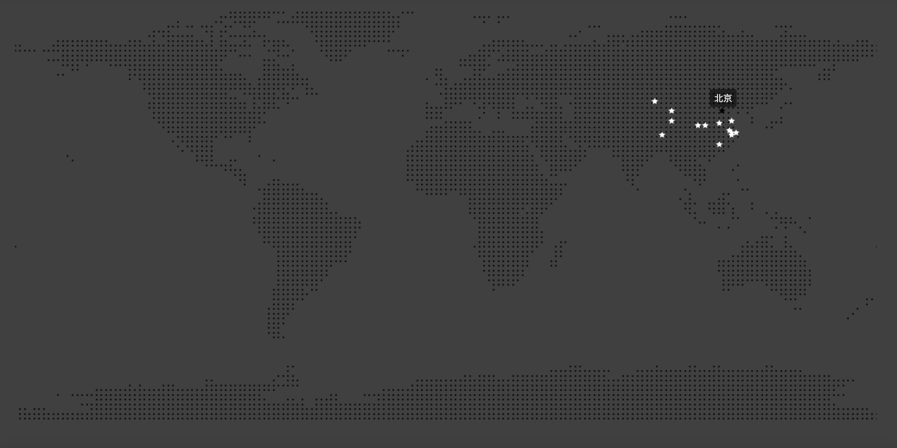

# dot-matrix-map

基于Cavans实现可交互的点阵地图。



## 安装使用

### 通过NPM安装，import导入

``` bash
npm install dot-matrix-map
```
``` javascript
import DotMatrixMap from 'dot-matrix-map';
```

### 通过Script标签引入

``` html
<script src="https://unpkg.com/dot-matrix-map/dist/index.min.js"></script>
```

### 示例

点击[DEMO](https://imkch.github.io/dot-matrix-map/examples/index.html)查看
``` html
<!DOCTYPE html>
<html lang="zh-CN">
  <head>
    <meta charset="utf-8">
    <title>基于Cavans实现可交互的点阵地图</title>
  </head>
  <body>
    <div class="app">
    </div>
    <script src="https://unpkg.com/dot-matrix-map/dist/index.min.js"></script>
    <script>
      const dotMatrixMap = new DotMatrixMap('app');
      dotMatrixMap.on('mousemove', (e, data)=> {
        console.log(data);
      });
      dotMatrixMap.addMarkDot([
        {
          name: '北京',
          coordinate: [116.43,39.90]
        },
        {
          name: '上海',
          coordinate: [121.48,31.23]
        }
      ]);
    </script>
  </body>
</html>
```
## API说明

### 类

- **DotMatrixMap(target, options)**
  - 说明：初始化实例，创建对象
  - 参数：
    - target（必填）
      - 类型：String || Element
      - 说明：挂载canvas的dom节点id或对象
    - options
      - 类型：Object || undefined
      - 说明：渲染参数
      - 示例：
      ```javascript
      const options = {
        backgroundColor: 'rgba(0, 0, 0, 0)', // 画布背景颜色
        baseDotColor: 'rgba(0, 0, 0, 0.75)', // 基础点颜色
        activeBaseDotColor: 'rgba(255, 255, 255, 0.5)', // 基础点鼠标移入高亮颜色
        markDotColor: 'rgba(255, 255, 255, 1)', // 标记点颜色
        activeMarkDotColor: 'rgba(0, 0, 0, 1)',  // 标记点鼠标移入高亮颜色
        markSize: 6 // 标价点大小，单位像素
      };
      ```
  - 示例：
  ```javascript
  const dotMatrixMap = new DotMatrixMap('app', options);
  ```

###  方法

- **addMarkDot(marks)**
  - 类型：Function
  - 说明：添加的标记点集合
  - 示例：
  ```javascript
  dotMatrixMap.addMarkDot([
    {
      name: '北京',
      coordinate: [116.43,39.90]
    },
    {
      name: '上海',
      coordinate: [121.48,31.23]
    }
  ]);
    ```

### 事件

可用事件名称：mousemove （标记点鼠标移入事件）。

- **on(eventName, callback)**
  - 类型：Function
  - 说明：添加监听事件方法
  - 示例：
  ```javascript
  const fn = (e, data) => {
    console.log(data);
  };
  dotMatrixMap.on('mousemove', fn);
  ```
- **off(eventName, callback)**
  - 类型：Function
  - 说明：取消监听事件方法
  - 示例：
  ```javascript
  dotMatrixMap.off('mousemove', fn);
  ```

## 版本更新说明

- **1.0.0**
  - 基础底图展示及鼠标交互
  - 添加标记点及鼠标交互
  - 添加标记点鼠标移入事件
